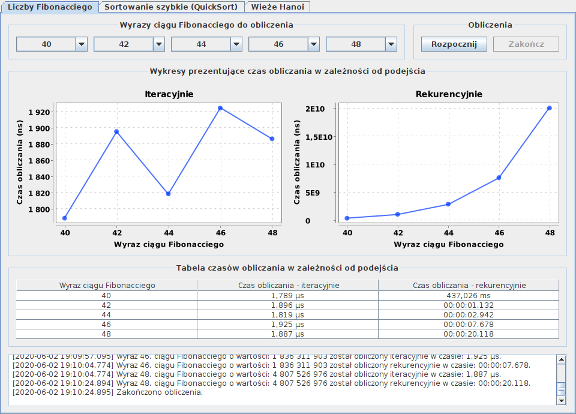

## Fibonacci, QuickSort, Hanoi (2020)

Aplikacja ma na celu pokazanie różnicy w czasie wykonywania operacji zaimplementowanych w dwóch podejściach: iteracyjnym i rekurencyjnym.

Zaimplementowano trzy operacje:
* obliczanie wybranego wyrazu ciągu Fibonacciego,
* sortowanie zestawu losowych liczb, o wybranej wielkości, za pomocą algorytmu QuickSort,
* układanie Wieży Hanoi, składającej z wybranej liczby krążków.

W przypadku każdej operacji istnieje możliwość wybrania zestawu pięciu, charakterystycznych dla danej operacji, danych wejściowych. Umożliwa to porównanie czasów wykonania, w zależności od poziomu złożoności operacji. 

Czas wykonywania operacji, z podziałem na podejście, prezentowany jest w postaci wykresów, tabeli oraz w konsoli tekstowej.

Autorzy: Mateusz Liber, Przemysław Lyschik

